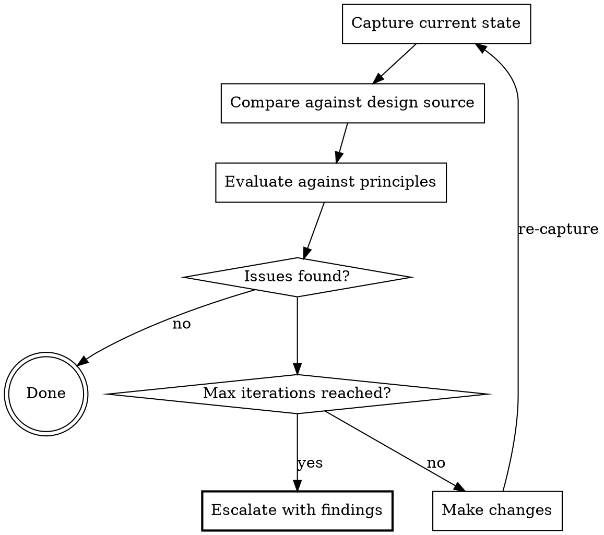

# Design Review

Autonomous capture → compare → fix → re-capture loop for evaluating UI against design sources.

The core protocol: capture the current state, compare against a design source, evaluate, make changes, re-capture — without waiting for the human to say "it's still off."

## When to Use

| Trigger | Mode |
|---------|------|
| Establishing visual direction early in a project | Foundation |
| Evaluating UI against typography, spacing, color principles | Either |
| Refining polish before shipping | Refinement |
| Checking adherence to a project's design system | Either |
| Comparing implementation against a mockup or Figma export | Refinement |
| Gathering design inspiration from the web | Foundation |

**When NOT to use:** For automated regression testing of visual snapshots — use the `visual-testing` skill instead. Design review evaluates quality; visual testing automates verification.

## The Iteration Loop

**Max iterations: 3–5.** After that, stop and escalate with a specific punch list of what remains and why. Do not loop forever.

Each iteration MUST re-capture. Never evaluate stale screenshots.

## Workflow

### 1. Detect Available Tools

Before starting, discover what capture and design-source tools are available:

| Capability | Example Tools |
|------------|---------------|
| Screenshot capture | Playwright (web, recommended), Maestro MCP (mobile), browser MCP, simulator screenshot CLI |
| Design source | Figma MCP, local mockup images, design tokens file, reference URL |
| Element inspection | Maestro `inspect_view_hierarchy`, browser DevTools MCP, Playwright locators |
| Navigation | Maestro flows, Playwright actions, browser MCP navigation |

Use whatever is available. If no capture tool exists, ask the human for screenshots.

### 2. Obtain the Design Source

| Source Type | How to Obtain |
|-------------|---------------|
| Mockup images | Figma MCP export, local PNG/SVG files, design handoff tool |
| Design spec | Tokens file (JSON/CSS variables), spacing/color documentation |
| Reference implementation | Screenshot of another page, component, or live URL |
| Style guide | Project's design system docs, component library storybook |

If no explicit design source exists, evaluate against the principles in `references/foundations.md` and the project's own established patterns.

### 3. Foundation Mode (Early Project)

1. Capture key screens
2. Gather inspiration: `web_search` / `web_fetch` from design resources (see below)
3. Evaluate against principles (see `references/foundations.md`)
4. Recommend direction aligned with project design system

### 4. Refinement Mode (Pre-Ship)

1. Audit all screens systematically
2. Compare each screen against design source
3. Run the iteration loop — fix issues, re-capture, re-compare
4. Output prioritized punch list of remaining issues

## Quick Evaluation Checklist

When reviewing a capture:

- **Typography** — Hierarchy clear? Weights/sizes consistent with spec?
- **Spacing** — Rhythm consistent? Matches design tokens?
- **Color** — Contrast sufficient? Semantic usage correct? Matches palette?
- **Layout** — Balance/alignment correct? Visual flow logical?
- **Platform** — Follows iOS HIG / Material / Web conventions?
- **Responsiveness** — Works at key breakpoints? (web)
- **Fidelity** — Matches the design source? What deviates and why?

See `references/checklist.md` for detailed criteria by mode.

## Design Resources

Search or fetch these for inspiration and patterns:

**Mobile:**
- **Mobbin** (mobbin.com) — Real app screenshots by category
- **Apple HIG** (developer.apple.com/design) — iOS conventions
- **Material Design** (m3.material.io) — Android/cross-platform patterns

**Web:**
- **Tailwind UI** (tailwindui.com) — Component patterns and layouts
- **MDN Web Docs** (developer.mozilla.org) — Web platform standards
- **Dribbble** (dribbble.com) — Visual concepts and exploration

**Cross-platform:**
- **shadcn/ui** (ui.shadcn.com) — Component architecture, CSS variable theming

## Project Design System

When a project has a design system (e.g., in PLAN.md, design-tokens.json):

1. Read the project's design system first
2. Evaluate captures against those specific tokens
3. Flag deviations: "Uses #fff but system defines text as #e2e8f0"

## Related Skills

| Skill | Relationship |
|-------|-------------|
| `brainstorming` | Visual Companion explores direction; design review picks up where brainstorming's visual exploration leaves off |
| `verification-before-completion` | Design review IS a form of verification — evidence before claims applies here too |
| `visual-testing` | Design review evaluates quality; visual testing automates regression verification — natural pair |

## References

| Document | When to Read |
|----------|--------------|
| [foundations.md](references/foundations.md) | Evaluating typography, spacing, color, layout |
| [checklist.md](references/checklist.md) | Detailed evaluation criteria by mode |
| [platforms.md](references/platforms.md) | Checking iOS/Android/Web conventions |
| [design-sources.md](references/design-sources.md) | How to obtain and compare against design sources |
