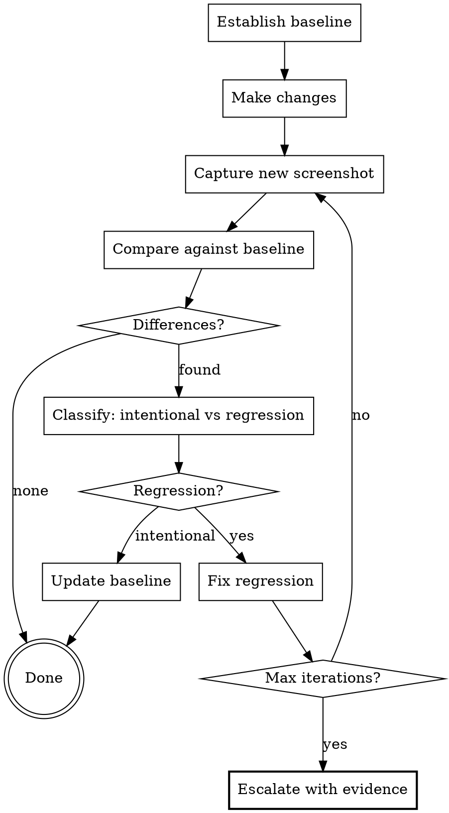

# Visual Testing

Automated visual regression testing — capture, compare, fix, re-capture — across platforms and tools.

The core protocol: establish a visual baseline, make changes, capture new state, compare, and autonomously iterate to fix regressions before escalating to the human.

## When to Use

| Trigger | Example |
|---------|---------|
| UI code changed | Component, layout, or style modifications |
| New feature with visual output | New screen, page, or component |
| Visual bug reported | Screenshot doesn't match expected |
| Pre-merge verification | Confirm no visual regressions before PR |
| Cross-platform consistency check | Same feature on iOS, Android, web |
| Design handoff validation | Implementation vs mockup comparison |

**When NOT to use:** For subjective design quality evaluation (typography, spacing, color choices) — use the `design-review` skill instead. Visual testing verifies consistency; design review evaluates quality.

## The Verification Loop



**Max iterations: 3–5.** After that, stop and escalate with before/after screenshots and a specific list of remaining issues. Do not loop forever.

Each iteration MUST re-capture. Never evaluate stale screenshots.

## Tool Selection

Before starting, detect what's available in the project. Use the first matching tool:

### Web

| Tool | Comparison Method | Best For |
|------|-------------------|----------|
| Playwright | `expect(screenshot).toMatchSnapshot()` | Pixel-perfect regression (**recommended**) |
| Cypress | `cy.screenshot()` + Percy/Applitools | Integration test flows |
| Browser MCP | Screenshot + AI visual analysis | Ad-hoc inspection |

### Mobile (React Native / Native)

| Tool | Comparison Method | Best For |
|------|-------------------|----------|
| Maestro MCP | `take_screenshot` + AI visual analysis | Cross-platform flows (recommended) |
| Detox | `device.takeScreenshot()` + pixel diff | React Native E2E |
| XCTest / Espresso | Native screenshot APIs | Platform-specific tests |

### Component-Level

| Tool | Comparison Method | Best For |
|------|-------------------|----------|
| Storybook + Chromatic | Automated visual diff | Component libraries (recommended) |
| Storybook + Percy | Cloud-based visual diff | CI/CD integration |
| Ladle + custom | Screenshot + diff | Lightweight alternative |

### Any Platform (Fallback)

When no dedicated visual testing tool is configured, use **AI-assisted visual comparison**:

1. Capture screenshot (any method — CLI tool, MCP, manual)
2. Analyze screenshot with LLM vision capabilities
3. Compare against baseline image or written design spec
4. Report differences with reasoning

This always works but is less precise than pixel-diff tools.

## Screenshot Analysis Criteria

When analyzing screenshots — whether via pixel diff or AI visual analysis — verify:

| Category | Check |
|----------|-------|
| **Data consistency** | Displayed counts match visible items |
| **Text integrity** | No truncation, overflow, or overlap |
| **Image loading** | All images loaded (no stuck placeholders) |
| **State correctness** | Correct state shown (not stuck loading/skeleton) |
| **Empty states** | Shows "0" or empty message, not stale data |
| **Alignment** | Elements properly aligned and spaced |
| **Touch targets** | Interactive elements ≥44pt (mobile) |
| **Responsive layout** | Correct layout at key breakpoints (web) |
| **Hover/focus states** | Correct visual feedback on interaction (web) |
| **Cross-browser** | Consistent rendering across target browsers (web) |

## Capture Methods Quick Reference

```bash
# Playwright — capture and compare
npx playwright test --update-snapshots     # update baselines
npx playwright test                         # run comparisons

# Maestro — capture screenshot
maestro test .maestro/flows/               # run all flows
maestro test .maestro/flows/ --output ./test-artifacts

# Storybook + Chromatic — visual diff
npx chromatic --project-token=<token>

# Generic — manual capture for AI analysis
screencapture -x screenshot.png            # macOS
adb exec-out screencap -p > screenshot.png # Android
xcrun simctl io booted screenshot screenshot.png # iOS Simulator
```

## Cleanup

After verifying all fixes, remove test artifacts:

```bash
# Remove generated screenshots
rm -rf test-artifacts/*.png
rm -rf test-results/*.png

# Check for stray screenshots in unexpected locations
find . -name "*.png" -not -path "*/node_modules/*" -not -path "*/assets/*" -not -path "*/.git/*" -newer <baseline-file>
```

**Rules:**
- Always clean up before committing — test artifacts should NOT be in version control unless they are intentional baselines
- Baseline images (e.g., Playwright snapshots in `__snapshots__/`) DO belong in VCS
- Diff output images and temporary captures do NOT
- Use `.gitignore` to exclude test artifact directories

## Common Mistakes

| Mistake | Fix |
|---------|-----|
| Comparing against stale baseline | Always re-capture baseline if underlying data or environment changed |
| Flaky tests from dynamic content | Mock time, data, and animations before capture |
| Ignoring viewport/device size | Set explicit viewport — screenshots vary by size |
| Skipping cleanup | Artifacts bloat repo and confuse future comparisons |
| Looping forever on pixel noise | Set max iterations; accept sub-pixel differences as passing |
| Testing only one breakpoint | Cover mobile, tablet, desktop for web |
| No baseline management strategy | Store baselines in VCS, update intentionally via dedicated commits |

## Related Skills

| Skill | Relationship |
|-------|-------------|
| `test-driven-development` | Visual tests follow the RED-GREEN cycle — write the visual assertion first, watch it fail, then implement |
| `verification-before-completion` | Visual testing provides screenshot evidence before claiming UI work is done |
| `systematic-debugging` | When visual tests fail unexpectedly, use debugging's 4-phase process to isolate the cause |
| `design-review` | Design review evaluates quality; visual testing automates regression verification — natural pair |

## References

| Document | When to Read |
|----------|--------------|
| [tool-comparison.md](references/tool-comparison.md) | Choosing between visual testing tools |
| [testing-patterns.md](references/testing-patterns.md) | Test organization and patterns across tools |
| [cross-platform.md](references/cross-platform.md) | Multi-platform visual testing strategies |
